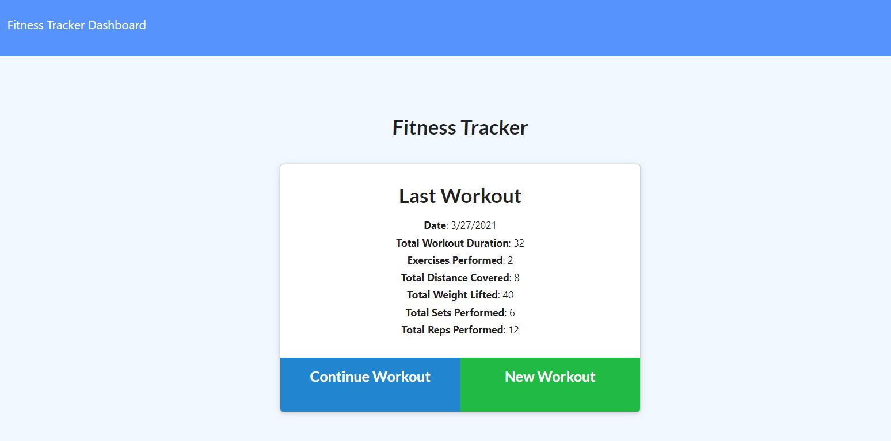
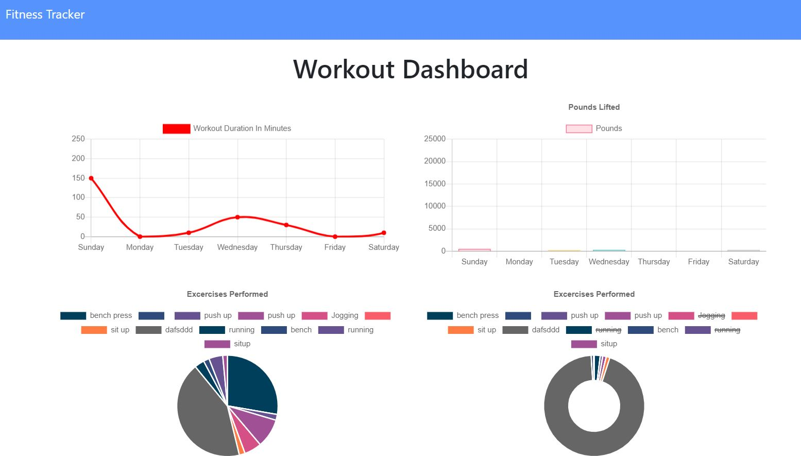

# Fitness Tracker

## User Story

As a user, I want to be able to view create and track daily workouts. I want to be able to log multiple exercises in a workout on a given day. I should also be able to track the name, type, weight, sets, reps, and duration of exercise. If the exercise is a cardio exercise, I should be able to track my distance traveled.

## Description

This app allows a user to add exercises to a previous workout plan and also add new exercies to a new work out plan then view the staticts of the daily workout.

## Installation

To make use of this app after cloning the github page run the following commands on you command line

1. npm i
2. nodemon server.js

## Deployment

This app was also deployed on heroku click on the link below
[Fitness App](https://fitnesstrackerjohn.herokuapp.com/)

## Usage

When the app is launch You will see a tab called New Workout click on this tap and begin to enter you work out information.

To see the dashboard for the exercises you have done click on the dashboard tab at the upper left corner of the page.

To go back to the fitness page to enter new or continue workerout click on the Fitness Tracker tap at the top left corner of the page

## License

